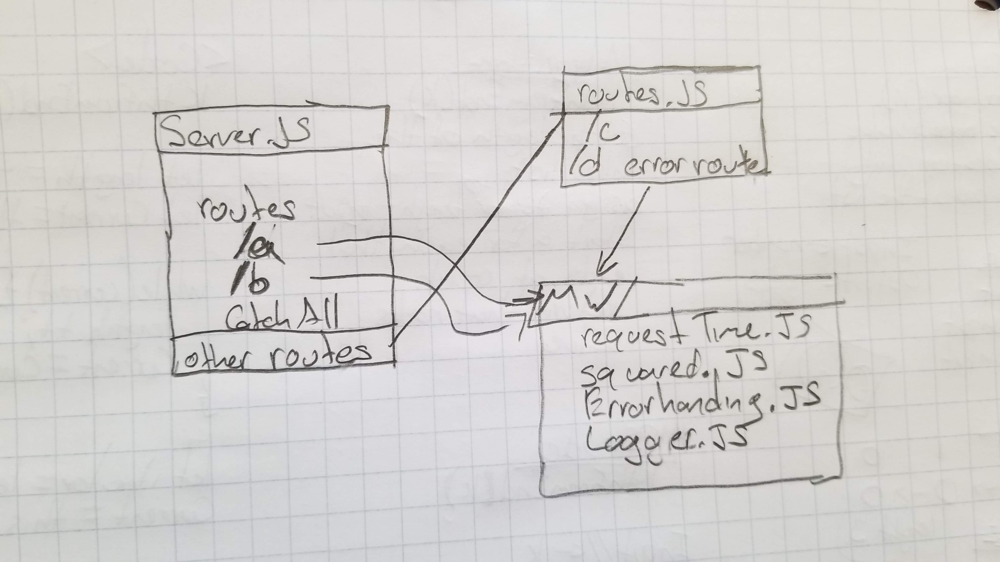

# lab-07-middleware

### Author: Matt Wilkin, Felipe Delatorre

### Links and Resources
[submission PR](https://github.com/mwilkin-401-advanced-javascript/lab-07-middleware/pull/2)

[travis](https://www.travis-ci.com/mwilkin-401-advanced-javascript/lab-04)

### Setup
#### `.env` requirements
* `PORT` - if none given the default is 3000

#### Running the app
* `npm start` Starts server
* Endpoint: `/a`
  * Returns current time.
* Endpoint: `/b`
  * Returns a numbered squared.
* Endpoint: `/c`
  * Returns Route C.
* Endpoint: `/d`
  * Raises and error and points to 404.
* Endpoint: `/any`
  * A catch-all routes for unknown routes.

#### UML

